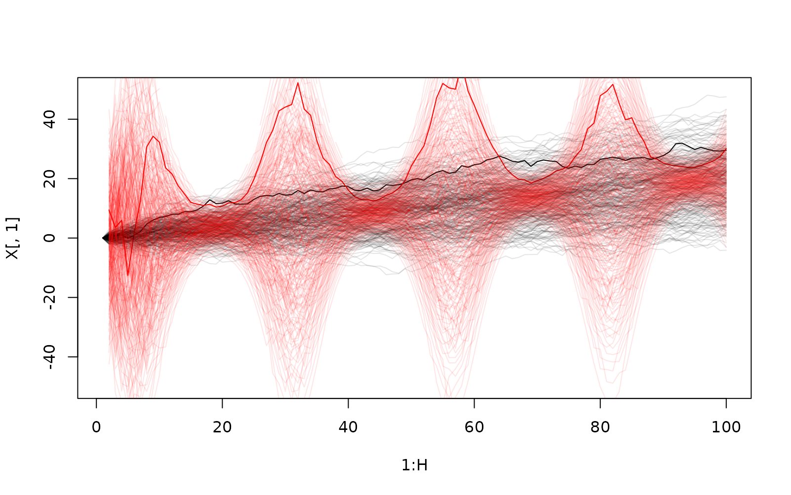

Quantile Mapping of Simulated Time-series
================
Jonas Schöley

We want to transform a collection of stochastic paths such that their marginal distribution at time $h$ follows a pre-specified target distribution. We achieve that by mapping the quantiles of all original paths to the corresponding quantiles of the target distribution. In the climate modeling literature this approach is known as "quantile-mapping".

**Paths of a standard normal random walk with drift mapped to a marginal normal distribution with cyclical variance.**